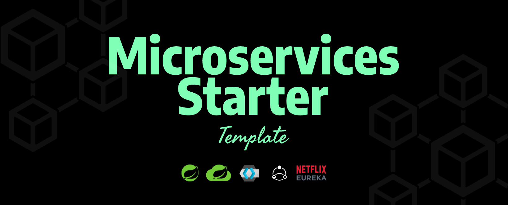

# Microservice Starter Template

## Table of Contents

- [Introduction](#introduction)
- [Features](#features)
- [Build Process](#build-process)
- [Tech Stack](#tech-stack)

## Introduction
A starter kit to getting started with microservice architecture using spring boot 3.

## Features

🚀 keycloak Authentication  
🚀 API Gateway using spring cloud gateway  
🚀 Service Discovery using Eureka  
🚀 Circuit Breaker using Resilience4j  

## Build Process

- Clone or download the repo
- `mvn clean install` to install dependencies
- `mvn spring-boot:run` to run the server application

## Multi Stage Docker Build
https://www.section.io/engineering-education/running-a-multi-container-springboot-postgresql-application-with-docker-compose/
https://spring.io/guides/topicals/spring-boot-docker/